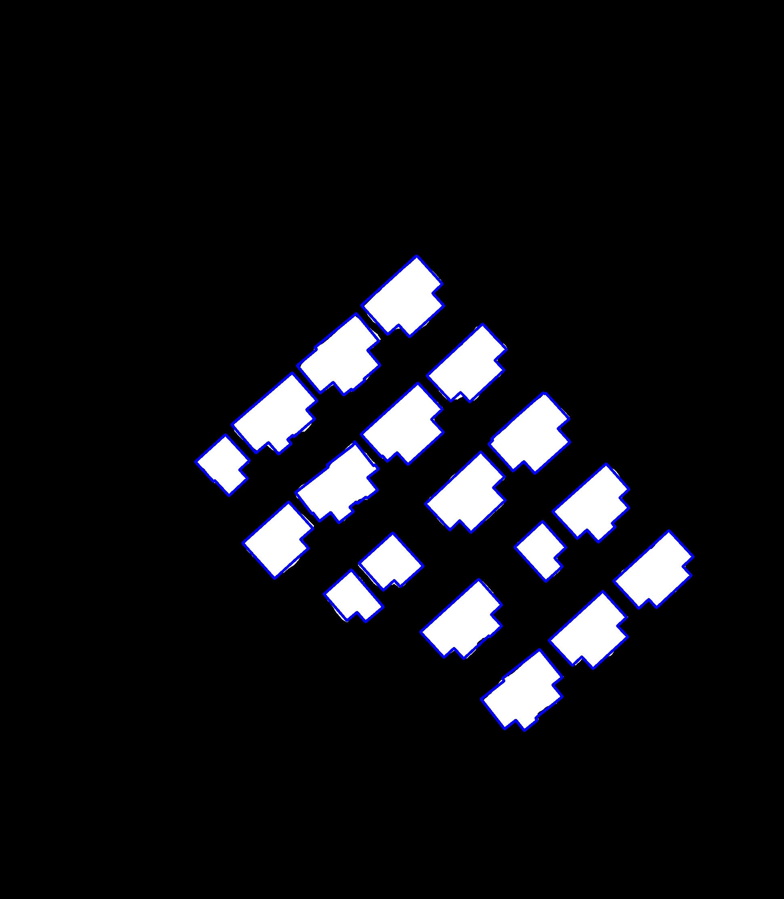

# 1. 本项目功能

本项目为参考`Toward Automatic Building Footprint Delineation
From Aerial Images Using CNNand Regularization`这篇论文自己复现的遥感场景建筑物分割后处理-轮廓规则化的代码，代码实现过程与文章并不完全一致，仅供参考。

# 2. 如何使用

进入`main_regularization.py`修改图片输入路径，目前主文件写作思路是给定一张建筑物二值分割结果图，首先进行联通域提取（无法解决粘连现象，这种前面可能要用实例分割），然后遍历每一个建筑物mask执行轮廓规则化。

# 3. 效果图

